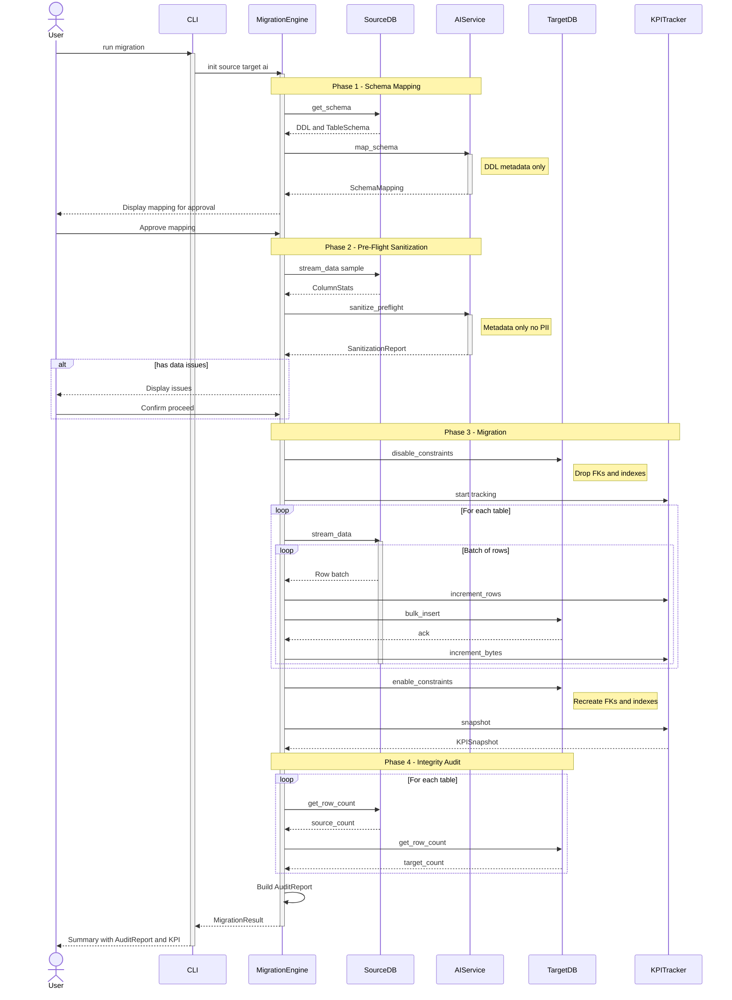
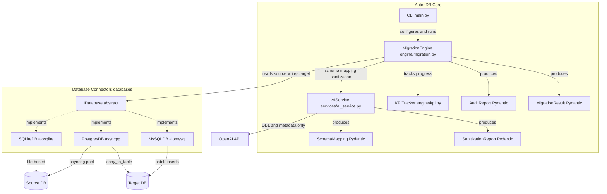

# AutonDB - Architecture

> Standalone files: [class_diagram.mermaid](./class_diagram.mermaid) | [sequence_diagram.mermaid](./sequence_diagram.mermaid) | [component_diagram.mermaid](./component_diagram.mermaid)
>
> Open `.mermaid` files directly in VSCode with the Mermaid extension for preview.

## Class Diagram

## Sequence Diagram - Migration Flow

## Component Diagram

