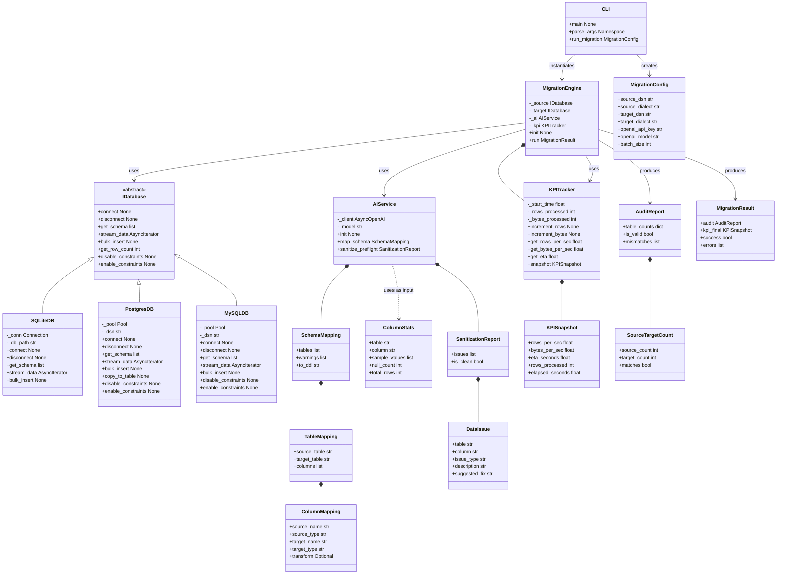
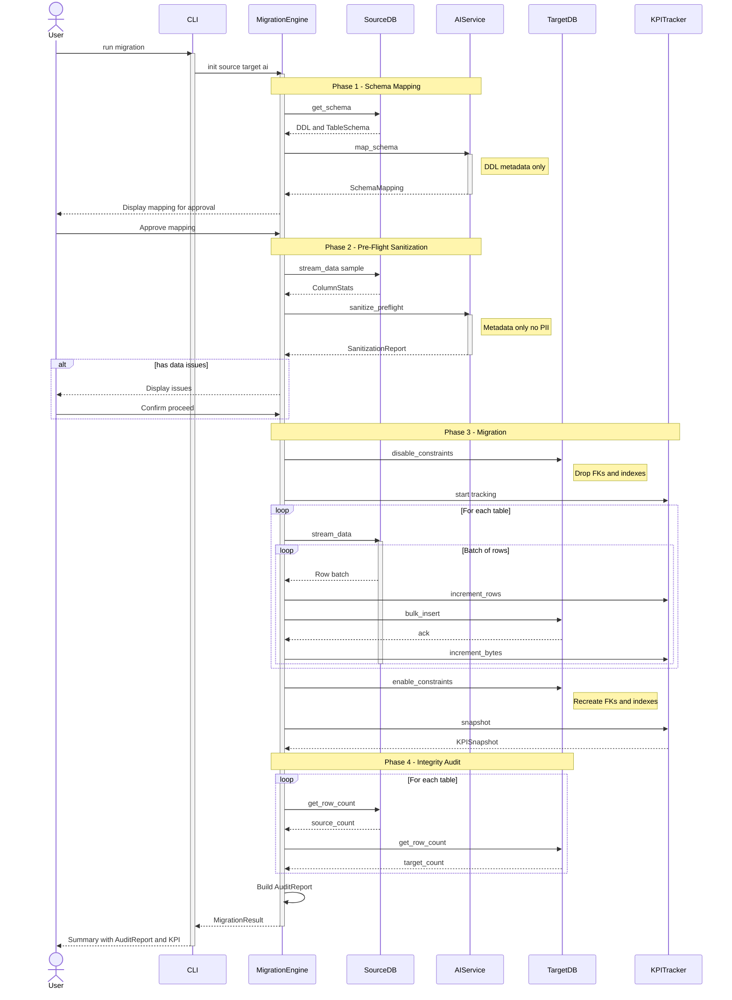
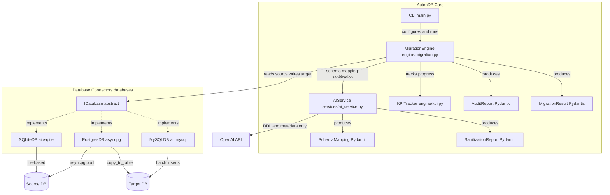

# Architecture

> Diagrams: [class_diagram.mermaid](./class_diagram.mermaid) | [sequence_diagram.mermaid](./sequence_diagram.mermaid) | [component_diagram.mermaid](./component_diagram.mermaid)
>
> Open `.mermaid` files in VSCode with the Mermaid extension for preview.

## Project Structure

```
src/
├── constants.py              # Shared magic-value constants (batch size, pool sizes, etc.)
├── main.py                  # CLI entry point
├── bridge.py                 # Tauri sidecar bridge (JSON-over-stdout)
├── engine/
│   ├── __init__.py           # Package exports
│   ├── migration.py          # MigrationEngine — orchestrator
│   ├── kpi_tracker.py        # KPITracker — real-time rows/s, MB/s, ETA
│   └── integrity_audit.py    # Post-migration COUNT audit
├── services/
│   ├── __init__.py           # Package exports
│   ├── ai_service.py         # AIService — multi-provider orchestrator
│   ├── models.py             # Pydantic models (SchemaMapping, SanitizationReport, etc.)
│   ├── prompts.py            # Prompt templates for schema mapping & sanitization
│   └── providers/            # AI provider implementations
│       ├── __init__.py       # Provider factory + registry (load_dotenv here)
│       ├── base.py           # AIProvider abstract base
│       ├── _json_utils.py    # Shared JSON extraction (markdown fence stripping)
│       ├── openai_compat.py  # OpenAI, Groq, OpenRouter (all OpenAI-compatible)
│       ├── anthropic_provider.py  # Anthropic Claude
│       └── synthetic.py      # Mock provider for testing
└── databases/               # Database connectors
    ├── __init__.py
    ├── factory.py            # DIALECTS registry + build_db()
    ├── identifier.py         # Shared validate_identifier() for SQL injection guard
    ├── idatabase.py          # IDatabase abstract base
    ├── sqlite_db.py          # SQLiteDB   (aiosqlite)
    ├── postgres_db.py        # PostgresDB (asyncpg)
    └── mysql_db.py           # MySQLDB    (aiomysql)

src-tauri/                    # Tauri 2 desktop app
├── Cargo.toml                # Rust deps (tauri, serde, dirs)
├── tauri.conf.json           # App config, sidecar binary path
├── src/
│   ├── main.rs               # Rust entry
│   └── lib.rs                # Tauri commands: analyze_schema, start_migration, download_audit_pdf
├── capabilities/default.json # Permission config
└── binaries/                 # PyInstaller sidecar (autondb-core)

ui/                           # Frontend (vanilla HTML/CSS/JS)
├── index.html                # 3 screens: config, preview, dashboard
├── css/style.css             # Dark theme, KPI cards, progress bar
└── js/app.js                 # Tauri API integration, event listeners
```

## Control Flow

1. User provides source & target connection strings + AI provider config (env var / .env)
2. Source DB connector streams schema (DDL) → AIService maps types to target dialect (returns structured JSON)
3. Caller collects column statistical metadata (sample values, null counts, distinct counts) → AIService validates compatibility (Pre-Flight Sanitizer)
4. User approves the AI-generated mapping
5. MigrationEngine disables FK constraints on target (`SET session_replication_role` / `SET FOREIGN_KEY_CHECKS`), streams data async from source → target, re-enables constraints
6. KPITracker reports rows/s, MB/s, ETA in real time
7. Post-migration integrity audit: COUNT per table, source vs target

## Key Design Decisions

- **All I/O is async** — every DB connector uses async drivers (aiosqlite, asyncpg, aiomysql)
- **AI never touches raw data** — only schema (DDL) and statistical metadata are sent to the AI provider
- **Constraints disabled during migration** — FKs are disabled via session-level flags before bulk insert, and re-enabled after, for speed. Indexes are not dropped/recreated.
- **`IDatabase` interface** — all connectors implement `connect()`, `disconnect()`, `get_schema()`, `stream_data()`, `bulk_insert()`, `execute_ddl()`, `get_row_count()`, `disable_constraints()`, `enable_constraints()`
- **`PostgresDB.copy_to_table()`** — available as an additional method for high-performance COPY protocol, but not yet wired into MigrationEngine (currently uses bulk INSERT)
- **Pydantic models** — used for structured validation (dependency already in `pyproject.toml`)
- **Multi-provider AI** — supports OpenAI, Groq, OpenRouter, Anthropic Claude, and Synthetic (mock) via `providers/` subpackage. Runtime switching via `ai_service.set_provider()`.
- **Shared constants** — magic values (batch size, pool sizes, max tokens, MB conversion, default target dialect) live in `src/constants.py` and are imported everywhere
- **DB factory** — `src/databases/factory.py` centralizes `DIALECTS` and `build_db()`, used by both CLI and bridge
- **JSON extraction** — shared `extract_json()` in `providers/_json_utils.py` strips markdown fences, used by OpenAI and Anthropic providers
- **Identifier validation** — `validate_identifier()` in `src/databases/identifier.py` guards against SQL injection in table/column names across all DB connectors
- **Provider env key mapping** — `PROVIDER_ENV_KEYS` in `src/services/providers/__init__.py` centralizes the mapping of provider names to API key env vars, used by both `create_provider()` and the Tauri bridge

## Class Diagram



## Sequence Diagram — Migration Flow



## Component Diagram


